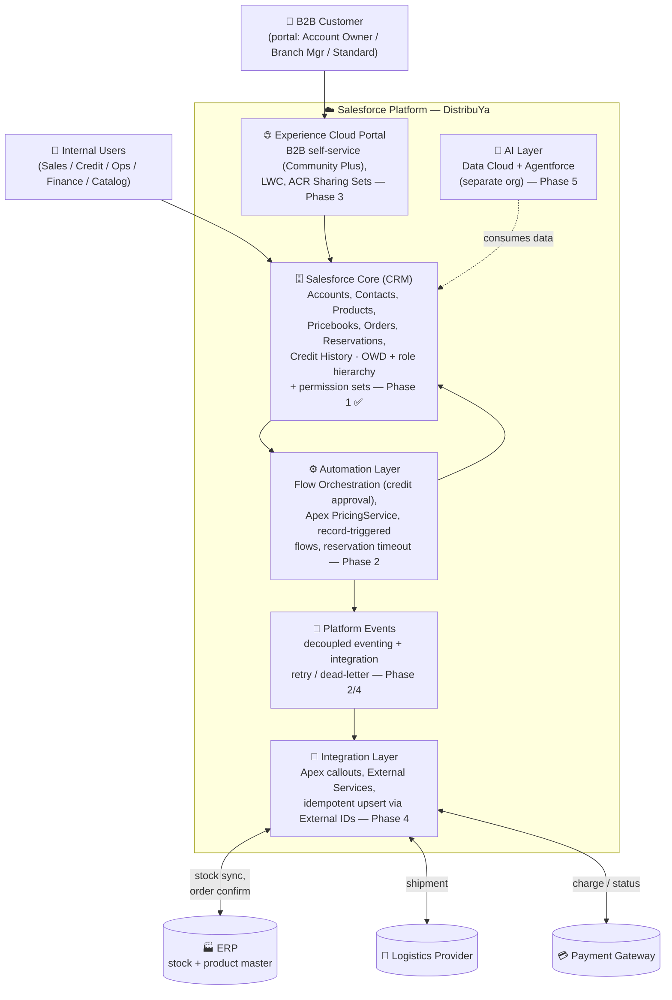

# C2 — Container Diagram (DistribuYa)

> **Purpose**: C4 Level 2 (Container) view of DistribuYa — the major building blocks inside the Salesforce platform and the external systems they talk to. Complements the [C1 Context](README.md) (Lucid) and the [data-model ERD](data-model-erd.md).
>
> **Reading note**: "Container" in C4 = a separately deployable/runnable unit, not a Docker container. On the Salesforce platform these are logical building blocks (Core CRM, automation runtime, portal, integration layer), not separate servers.
>
> **Status**: As of Phase 1, the **Salesforce Core** container (data model + sharing/security) is built. Other containers are placed here as the target architecture; they are materialized in later phases (annotated per block).

## Diagram

## Containers

| Container | Responsibility | Phase | WAF emphasis |
|---|---|---|---|
| **Salesforce Core (CRM)** | System of record for customers, catalog, pricing, orders, reservations, credit. Enforces visibility via OWD + role hierarchy + permission sets. | 1 ✅ | Trusted, Composable |
| **Automation Layer** | Credit-approval orchestration, pricing resolution, lifecycle automation, reservation expiry. | 2 | Easy to Change, Resilient |
| **Platform Events** | Decoupled, asynchronous eventing; backbone for integration retry / dead-letter. | 2 / 4 | Resilient, Composable |
| **Experience Cloud Portal** | B2B customer self-service (catalog, ordering); multi-branch visibility via ACR Sharing Sets. | 3 | Trusted, Adaptable |
| **Integration Layer** | Outbound/inbound with ERP, logistics, payments; idempotent via External IDs. | 4 | Resilient, Composable |
| **AI Layer** | Demand forecasting + agent assistance via Data Cloud + Agentforce (separate org, see [org-strategy](../org-strategy.md)). | 5 | Adaptable |

## External systems

| System | Direction | Notes |
|---|---|---|
| **ERP** | bidirectional | Source of truth for physical stock + product master; SF holds commercial txns + reservations (ADR-0006). |
| **Logistics Provider** | outbound | Shipment creation/tracking (Phase 4). |
| **Payment Gateway** | bidirectional | Charge + payment status feeding `Order.Payment_Status__c` (Phase 4). |
