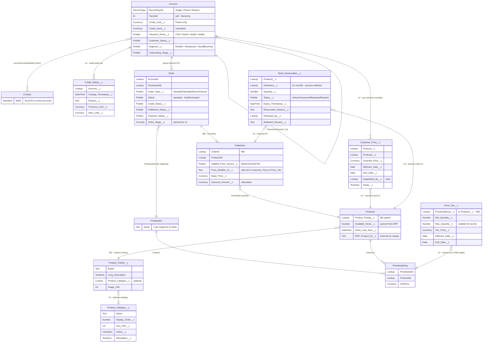

# Data Model — Entity Relationship Diagram (Phase 1)

> **Purpose**: Consolidated ERD of all entities closed during Phase 1 Block B (Customer, Product, Order, and Stock domains). This is the synthesis of every modeling decision recorded in [decisions-log.md](../../phase-01/decisions-log.md). It is a living document — it will be updated as Pending items in Block B are closed.
>
> **C4 level**: This sits below C3 — it is the logical data model (entity/relationship view), complementary to the C2 Container and C3 Component diagrams. Salesforce Schema Builder covers the physical equivalent; this Mermaid version is the versioned, reviewable source of truth.

## Legend

- **Standard** objects: `Account`, `Contact`, `AccountContactRelation`, `Product2`, `Pricebook2`, `PricebookEntry`, `Order`, `OrderItem`.
- **Custom** objects (`__c`): `Credit_History__c`, `Product_Family__c`, `Product_Category__c`, `Customer_Price__c`, `Price_Tier__c`, `Stock_Reservation__c`.
- **Custom Metadata** (`__mdt`): `Credit_Approval_Tier__mdt` — configuration, not transactional data, so it is **not** drawn as an ERD entity (see note below).
- Relationship notation: `||` one (mandatory), `o{` zero-or-many, `|{` one-or-many, `o|` zero-or-one.
- **MD** = Master-Detail, **LK** = Lookup (annotated on each relationship).

## Diagram

## Notes & cross-references

- **`Credit_Approval_Tier__mdt`** (Custom Metadata Type) holds the credit approval matrix (Tier 1 / 2 / 3 with `Min_Ratio__c`, `Max_Ratio__c`, `Approver_Role__c`). It is read by the Flow Orchestration during credit approval. As configuration metadata it is intentionally excluded from the ERD entities.
- **`OrderItem.Price_Modifier_Id__c`** is a *soft* reference (Text) to either `Customer_Price__c` or `Price_Tier__c`, recording which modifier produced the applied price. It is **not** a foreign key, so it is shown as an attribute, not a relationship line. This is deliberate (a single field can point to two different objects for audit purposes).
- **`AccountContactRelation`** is the standard junction object enabling the many-to-many between `Account` and `Contact` (Account Contact Relationships). Drawn here as the `}o--o{` relationship rather than as a separate box, for readability.

## ⚠️ Open modeling item (carried from decisions-log)

- **`Price_Tier__c` relationship target is still TBD.** This ERD models it as a Lookup to **`PricebookEntry`** (rationale: this makes volume tiers *segment-aware* — each of the 3 segment Pricebooks can have its own tiers, consistent with the segmented pricing architecture). The alternative is a Lookup to **`Product2`** (global tiers across all segments). This will be resolved during fine modeling / when ADR #12 is authored. **If you prefer global tiers, tell me and I update the diagram.**
